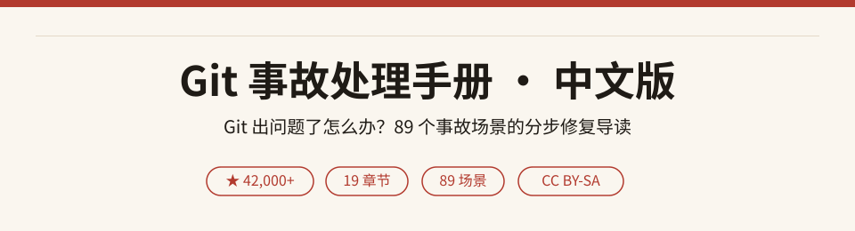
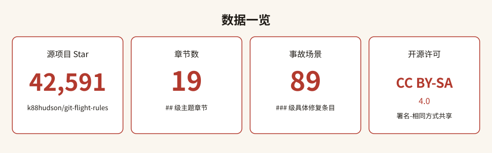
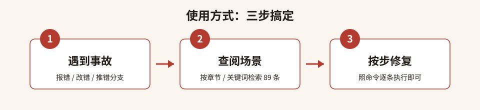

# Git 事故处理手册 · 中文版

> 把 42,000+ Star 的世界级 Git 急救手册，翻译成中文场景索引。
> 收录 **19 大章节、89 个真实事故场景**，提交写错、分支推错、敏感文件泄露、hard reset 翻车——照着查，照着修。

---

## 目录

- [这是什么](#这是什么)
- [为什么值得收藏](#为什么值得收藏)
- [数据一览](#数据一览)
- [快速开始](#快速开始)
- [分类清单](#分类清单)
- [全量场景索引](#全量场景索引)
- [FAQ](#faq)
- [参与贡献](#参与贡献)
- [致谢](#致谢)
- [许可声明](#许可声明)

## 这是什么

**Git 事故处理手册**（*Flight Rules for Git*）是一份"出事了怎么办"的操作手册：它不教你 Git 入门，而是专门收录**用 Git 时真实踩过的坑**——提交信息写错了、不小心 `reset --hard` 丢了代码、把敏感文件提交进了历史、在错误的分支上 commit、force push 后找不回提交……每个场景都给出一步到位的修复命令。

"飞行规则（Flight Rules）"一词源自 NASA：把历次任务中出过的故障与处置步骤写成手册，遇到同类情况照做即可。本仓库把这份 42,000+ Star 的英文手册整理成**中文导读 + 全量场景索引**，方便中文开发者按图索骥。

## 为什么值得收藏

- **42,591 ★ 实测验证**：源项目是 GitHub 上最受欢迎的 Git 排错参考之一。
- **89 个真实事故场景**：不是语法教程，全是"我刚才干了什么 / 怎么救"。
- **按场景分类**：提交、暂存、分支、合并、储藏、子模块、配置……翻车在哪个环节，就去对应章节。
- **中文索引直达**：每条场景给出中文译名 + 英文原名，检索关键词即可定位。
- **急救兜底**：就算完全不知道自己改了什么，也有 `reflog` 一章教你把仓库拉回正轨。

## 数据一览

## 快速开始

1. **遇到事故**：报错了、改错了、推错分支了，先别慌。
2. **查阅场景**：在[分类清单](#分类清单)或[全量场景索引](./scenarios-index.md)里找到最贴近你处境的一条。
3. **按步修复**：点进源项目对应小节，照命令逐条执行。

> 本仓库不复制源文命令正文，只做导航与导读；所有具体步骤请回到源项目 README。

## 分类清单

| 章节 | 场景数 | 代表场景 |
| --- | --- | --- |
| 仓库 Repositories | 4 | 克隆远程仓库、设置了错误的远程、给别人仓库贡献代码 |
| 编辑提交 Editing Commits | 13 | 提交信息写错、误推敏感数据、hard reset 后找回改动、抹除历史大文件 |
| 暂存 Staging | 9 | 只暂存文件部分改动、暂存太多想拆分、取消暂存某文件 |
| 放弃修改 Discarding changes | 5 | 放弃本地未提交改动、放弃未跟踪文件 |
| 分支 Branches | 20 | 本想建新分支却提交到 main、误删分支、在错误分支上改动 |
| 变基与合并 Rebasing and Merging | 6 | 撤销 rebase/merge、合并多个提交、交互式 rebase 冲突 |
| 储藏 Stash | 5 | 储藏所有改动、按列表应用某个储藏 |
| 查找 Finding | 5 | 在任意提交中搜字符串、按作者查提交、追踪某函数历史 |
| 子模块 Submodules | 2 | 递归克隆子模块、彻底移除子模块 |
| 杂项对象 Miscellaneous Objects | 7 | 恢复已删除文件/标签、PR 补丁被删、同名分支与标签推送 |
| 跟踪文件 Tracking Files | 6 | 改文件名大小写、文件回退到特定版本、让 Git 忽略某文件改动 |
| Git 调试 Debugging with Git | 0 | 正文讲解 `git bisect` 二分定位 bug 引入提交 |
| 配置 Configuration | 5 | 命令别名、缓存账号密码、全局 user 信息 |
| 不知出错 I've no idea what I did wrong | 0 | 正文讲解 `git reflog` 急救 |
| Git 快捷方式 Git Shortcuts | 2 | Git Bash / PowerShell 别名 |
| 书籍 / 教程 / 脚本工具 / GUI 客户端 | 0 | 资源推荐列表 |

## 全量场景索引

完整 89 条场景（中文译名 + 英文原名对照）见 👉 **[scenarios-index.md](./scenarios-index.md)**。

## FAQ

**Q：不小心 `git reset --hard` 把改动弄丢了怎么办？**
A：别慌。本地提交过的内容基本都能靠 `git reflog` 找回——源项目"编辑提交"与"完全不知道自己干了什么"两章专门讲这个。索引第 13 条与第 14 节。

**Q：不小心提交了不该提交的文件（密钥、密码）怎么办？**
A：先 rotate/作废泄露的凭据；再按"编辑提交"章"误推含敏感数据的文件"与"从历史中抹除大文件/敏感文件"两条处理（索引第 15、16 条），必要时用 bfg 或 `git filter-branch` 重写历史。

**Q：本想新建分支，结果直接提交到了 main？**
A：见"分支"章"本想建新分支却提交到 main"（索引第 38 条），可把提交挪到新分支再把 main 回退。

**Q：`git push` 报错说 amended 提交推不上去？**
A：见"编辑提交"章（索引第 12 条），这是因为改写了已推送的历史，需要团队协调后再 force push。

**Q：本仓库有完整命令吗？**
A：没有。本仓库只做中文导读与场景索引，不复制源文正文；具体命令请访问源项目（见下）。

## 参与贡献

本仓库是中文整理导读：欢迎修正译名、补充中文意译、提出索引改进。提 Issue 或 PR 即可。所有新增文案以 MIT 发布，对源场景标题的翻译继续遵守源项目 CC BY-SA 4.0。

## 致谢

- 源项目 [**k88hudson/git-flight-rules**](https://github.com/k88hudson/git-flight-rules)，作者 [k88hudson（Kate Hudson）](https://github.com/k88hudson) 及全体贡献者。
- 本手册灵感来自 Chris Hadfield《An Astronaut's Guide to Life on Earth》中关于 NASA 飞行规则的论述。

## 许可声明

- **本仓库新增文案**（README、索引译名、SVG 配图等）：以 **MIT** 许可发布，见 [LICENSE](./LICENSE)，Copyright (c) 2026 zieang88888。
- **源项目内容**：采用 **CC BY-SA 4.0**（Creative Commons Attribution-ShareAlike 4.0 International）。本仓库对源场景标题的翻译与索引继续遵守其署名与相同方式共享要求；详见 [THIRD_PARTY_NOTICES.md](./THIRD_PARTY_NOTICES.md)。
- 统计数据（星数 42,591、章节 19、场景 89）于 **2026-10-06** 经 GitHub API 与源 README 实测核实。
